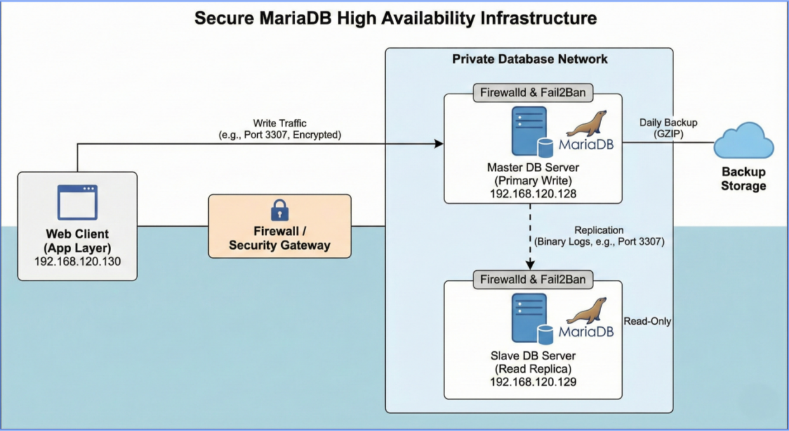

# Secure MariaDB Infrastructure with High Availability (Master-Slave Replication)

## 📌 Project Overview
This project demonstrates the design, deployment, and security hardening of a Linux-based MariaDB database environment. Designed to simulate a healthcare data scenario, the infrastructure prioritizes **Data Confidentiality, Integrity, and Availability (CIA)**.

Key achievements include implementing **Column-Level Encryption** for PII (Personally Identifiable Information), enforcing **Role-Based Access Control (RBAC)**, and establishing **Master-Slave Replication** for disaster recovery.

##

### 🎯 Key Objectives
* **Database Hardening:** Mitigating threats via OS and SQL configuration tuning.
* **Data Protection:** Implementation of AES-256 encryption for sensitive health records.
* **High Availability:** configuring asynchronous replication to ensure business continuity.
* **Network Security:** Implementing custom ports, firewall rich rules, and DMZ simulation.

---

## 🏗️ System Architecture
The environment consists of three Virtual Machines (VMs) simulating a segmented enterprise network.

| Machine Role | Hostname/IP | OS | Function |
| :--- | :--- | :--- | :--- |
| **Master Node** | `DB-Master` (192.168.120.128) | CentOS | Primary Write Server, Encrypted Data Store |
| **Slave Node** | `DB-Slave` (192.168.120.129) | CentOS | Read-Only Replica, Failover Target |
| **Web Client** | `Web-App` (192.168.120.130) | CentOS | Application Layer (Simulated DMZ) |

---

## Topology Diagram

  

---

## 🔒 Security Implementation (CIA Triad)

### 1. Confidentiality (Encryption & Access)
* **Data at Rest:** Critical columns (`patient_name`, `diagnosis`) are encrypted using `AES_ENCRYPT` with a private key.
* **Network:** Traffic restricted via **Firewalld Rich Rules**.
* **Access:** Least Privilege enforced. The Web App cannot decrypt data; only specific Analysts can.

### 2. Integrity (RBAC & Hardening)
* **Role-Based Access Control (RBAC):**
    * `db_admin`: Full Root Access (Local Only).
    * `app_analyst`: SELECT/INSERT privileges.
    * `slave_user`: Replication rights only.
* **Hardening:** Default port changed to `3307`, Version hidden, Root remote login disabled.

### 3. Availability (Redundancy)
* **Replication:** Asynchronous Master-Slave replication configured.
* **Backups:** Automated bash scripts for daily logical backups (`mysqldump`).

---

## 🛠️ Detailed Technical Implementation & Evidence
*Below is the breakdown of tasks executed to secure the environment, including evidence of configuration.*

### Task 1: Data Classification & Cryptographic Protection
**Objective:** Identify PII (Personally Identifiable Information) and apply encryption at rest.
 
**Implementation:**
* Classified `patient_name` and `diagnosis` as **Critical/High Impact** data.
* Implemented **Column-Level Encryption** using MariaDB's `AES_ENCRYPT()` function.
* **Evidence 1:** [📸 Encrypted vs. Decrypted Data Query](./images/Task%202.0.png)

### Task 2: Network Security & Traffic Filtering
**Objective:** Enforce strict network-level access controls to prevent unauthorized connections.
 
**Implementation:**
* Deployed **Firewalld** with "Rich Rules".
* Configured Master to **only accept TCP traffic on Port 3307** originating from Web Client (`192.168.120.130`) and Slave (`192.168.120.129`).
* **Evidence 1:** [📸 Firewalld Rich Rules Configuration](./images/Task%203.0.png)

### Task 3: Database Hardening & Obscurity
**Objective:** Reduce the vulnerability footprint by applying industry-standard hardening techniques.
 
**Implementation:**
* **Port Obscurity:** Changed default port `3306` -> `3307`.
* **Version Hiding:** Suppressed database version info.
* **Root Restriction:** Disabled remote `root` login.
* **Evidence 1:** [📸 Secure Installation & Root Restriction](./images/Task%204.0.png)
* **Evidence 2:** [📸 Custom Port & Config File](./images/Task%204.1.png)

### Task 4: Identity & Access Management (RBAC)
**Objective:** Implement the Principle of Least Privilege using Role-Based Access Control.
 
**Implementation:**
* Created distinct user roles: `web_app` (limited), `auditor` (read-only), and `db_admin` (local only).
* **Evidence 1:** [📸 User Roles & Grants List](./images/Task%205.0.png)
* **Evidence 2:** [📸 'Auditor' User Access Denied (Integrity Check)](./images/Task%205.1.png)
* **Evidence 3:** [📸 'Web App' User Successful Access](./images/Task%205.2.png)

### Task 5: Active Threat Mitigation (Intrusion Prevention)
**Objective:** Detect and block brute-force authentication attacks.
 
**Implementation:**
* Integrated **Fail2Ban** to monitor `/var/log/mariadb/mariadb.log`.
* Configured a custom jail to ban IPs for 10 minutes after 3 failed login attempts.
* **Evidence 1:** [📸 Fail2Ban Jail Configuration](./images/Task%206.0.png)
* **Evidence 2:** [📸 Fail2Ban Status & Banned IP](./images/Task%206.1.png)

### Task 6: Disaster Recovery & Automated Maintenance
**Objective:** Ensure data availability and recoverability.
 
**Implementation:**
* Developed `secure_backup.sh` for daily `mysqldump` with GZIP compression.
* Scheduled via `crontab` for 10:10 PM daily execution.
* **Evidence 1:** [📸 Backup Script Content](./images/Task%207.0.png)
* **Evidence 2:** [📸 Verified Backup File Creation](./images/Task%207.1.png)

### Task 7: High Availability (Master-Slave Replication)
**Objective:** Eliminate single points of failure by implementing database redundancy.
 
**Implementation:**
* Configured **Asynchronous Replication** between Master (`192.168.120.128`) and Slave (`192.168.120.129`).
* Verified synchronization using `SHOW SLAVE STATUS\G`.
* **Evidence 1:** [📸 Master Status (Log File & Position)](./images/Task%208.0.png)
* **Evidence 2:** [📸 Secure Transfer of Base Backup (SCP)](./images/Task%208.1.png)
* **Evidence 3:** [📸 Slave Status (Sync Success)](./images/Task%208.2.png)

---
